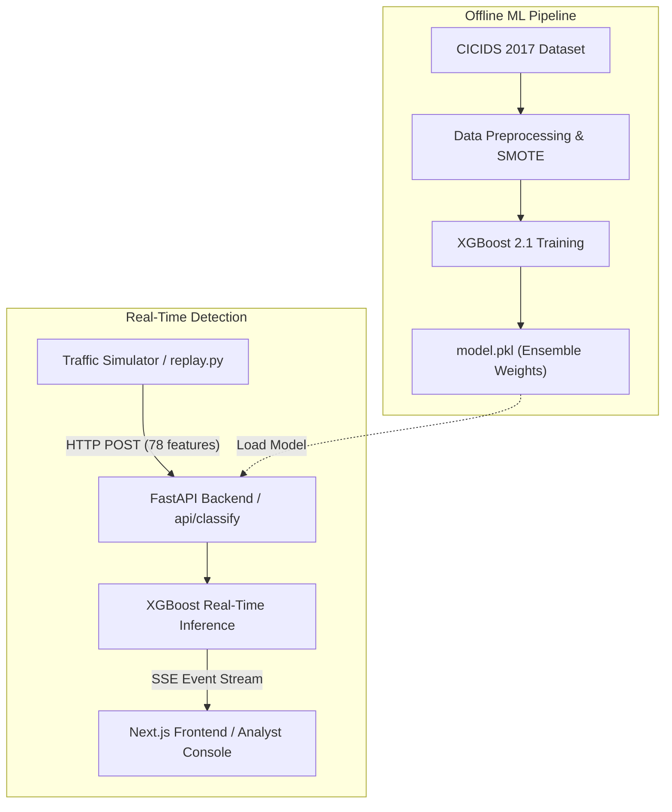

# SentinelAI

**Real-Time Intrusion Detection System**  
Cyber Defense & Security Analyst Internship — Blackbucks · 2026

SentinelAI is a full-stack, real-time intrusion detection platform designed to classify network traffic and stream threat alerts. Utilizing a machine learning classifier trained on the CICIDS 2017 benchmark dataset, the system detects 14 specific attack classes alongside normal traffic, achieving a 99.77% Weighted F1-score.

---

## Architecture



---

## Model Performance

| Metric | Score |
|--------|-------|
| **Weighted F1-Score** | **99.77%** |
| **Accuracy** | **99.77%** |
| **False Positive Rate** | **< 0.5%** |
| **Dataset** | CICIDS 2017 (2.8 Million flows) |
| **Classifier** | XGBoost 2.1 |

### Classification Report

```text
                            precision    recall  f1-score   support

                    BENIGN       1.00      1.00      1.00    419012
                        Bot       0.38      1.00      0.55       390
                       DDoS       1.00      1.00      1.00     25603
              DoS GoldenEye       0.98      1.00      0.99      2057
                   DoS Hulk       1.00      1.00      1.00     34569
           DoS Slowhttptest       0.96      1.00      0.98      1046
              DoS slowloris       0.98      0.99      0.98      1077
                FTP-Patator       1.00      1.00      1.00      1186
                 Heartbleed       0.67      1.00      0.80         2
               Infiltration       0.70      1.00      0.82         7
                   PortScan       0.99      1.00      0.99     18139
                SSH-Patator       0.99      1.00      1.00       644
   Web Attack - Brute Force       0.72      0.70      0.71       294
 Web Attack - Sql Injection       0.10      0.50      0.17         4
           Web Attack - XSS       0.30      0.58      0.40       130
```

### Confusion Matrix


---

## Tech Stack Summary

* **ML Pipeline:** Python 3.12 · XGBoost 2.1 · Scikit-learn 1.5 · SMOTE
* **FastAPI Backend:** FastAPI 0.115 · Uvicorn · Pydantic v2 · JWT · Bcrypt
* **Next.js Frontend:** Next.js 16 · React 19 · TypeScript · Recharts · Tailwind CSS v4 (Refer to [frontend/README.md](file:///d:/sentinelai/frontend/README.md) for UI details)

---

## Quick Setup & Launch Checklist

Ensure Python 3.12+ and Node.js 20+ are installed.

```bash
# 1. Clone & Configure Environment
git clone https://github.com/Shyamyemuka/sentinelai.git
cd sentinelai
cp .env.example .env

# 2. Virtual Env setup & ML Training
python -m venv venv
./venv/Scripts/activate     # Windows
pip install -r ml/requirements.txt
python ml/preprocess.py
python ml/train.py

# 3. Start Backend Server
pip install -r backend/requirements.txt
uvicorn backend.main:app --host 127.0.0.1 --port 8000 --reload

# 4. Start Next.js Frontend (New Terminal)
cd frontend
npm install
npm run dev

# 5. Start Replay Simulator Ingestion (New Terminal)
python ml/replay.py --password sentinelaipass --delay 0.5 --limit 1000
```

---

## Project Structure

```text
sentinelai/
├── ml/
│   ├── preprocess.py      # Cleans, downsamples, and balances dataset
│   ├── train.py           # Trains the XGBoost model
│   ├── evaluate.py        # Validates model metrics against the test subset
│   └── replay.py          # Ingestion simulator script
├── backend/
│   ├── main.py            # API server routing
│   ├── auth.py            # Password hashing & JWT validation
│   ├── classify.py        # Real-time inference routing
│   ├── stream.py          # Server-Sent Events broker
│   ├── schemas.py         # Network flow validators
│   └── config.py          # Settings loader
├── frontend/
│   ├── app/               # Landing, Login, and Dashboard routers
│   ├── components/        # Interactive visuals and feeds
│   └── README.md          # Frontend architecture specifications
├── .env.example
├── .gitignore
└── README.md
```

---

## Internship Details

**Author:** Shyam  
*B.Tech CSE (Data Science) · AITS Rajampet*  
**Role:** Cyber Defense & Security Analyst Intern  
**Company:** Blackbucks  
**Project Year:** 2026
