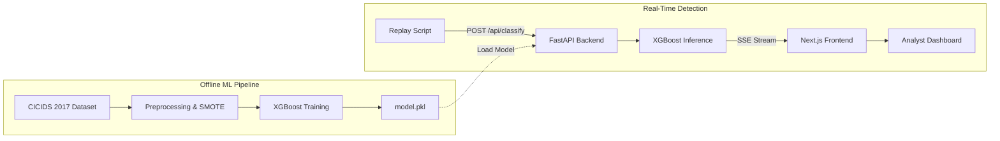

# SentinelAI

**Real-Time Intrusion Detection System**  
Cyber Defense & Security Analyst Internship — Blackbucks · 2026

SentinelAI is a full-stack, real-time intrusion detection platform designed to classify network traffic and stream threat alerts to an analyst console. Leveraging a machine learning classifier trained on the CICIDS 2017 benchmark dataset, the system achieves a 99.77% Weighted F1-score across 15 classification categories (14 specific attack classes and normal traffic).

---

## Features

### Machine Learning Pipeline
* **Balanced Data Preprocessing:** Automated data acquisition, cleaning of Unicode anomalies, and class balancing using a hybrid downsampling and SMOTE oversampling pipeline.
* **XGBoost Classifier:** High-performance multiclass inference utilizing XGBoost 2.1.
* **Evaluation Suite:** Static evaluation generating standard classification reports and confusion matrix plots using a headless rendering backend.
* **Live Replay Simulator:** Traffic replay script that simulates live network flow ingestion by streaming rows to the classification endpoint.

### FastAPI Backend
* **Inference Endpoint:** Receives 78 network flow features, validates them using Pydantic schemas, and runs real-time model inference.
* **Server-Sent Events (SSE) Stream:** Broadcasts classified alerts to connected clients in real time.
* **Authentication Engine:** Secure password verification using direct `bcrypt` hashing and JWT issuance.
* **Hardened Security Middleware:** Strict CORS settings, custom security response headers, and automatic stack trace suppression.

### Next.js Frontend
* **Landing Page:** Professional landing interface presenting core capabilities and high-level project metrics.
* **Administrative Login:** Gateway utilizing HTTP-only cookie session management to protect downstream dashboard routes.
* **Analyst Dashboard:** A unified, real-time interface containing:
  * **Metric Tiles:** Live status metrics tracking total flow volume, benign traffic percentages, and attack detection counts.
  * **Live Alert Feed:** An auto-scrolling terminal feed displaying incoming flows with color-coded threat severity.
  * **Interactive Feature Inspector:** Granular inspector panel displaying all 78 classification features upon selecting an alert.
  * **Visual Analytics:** Real-time distribution chart mapping threat classes using Recharts.

---

## Architecture



---

## Model Performance

| Metric | Score |
|--------|-------|
| **Weighted F1-Score** | **0.9977 (99.77%)** |
| **Accuracy** | **99.77%** |
| **False Positive Rate** | **< 0.5%** |
| **Dataset** | CICIDS 2017 (2.8 Million flows) |
| **Classifier** | XGBoost 2.1 |
| **Classes** | 15 (BENIGN + 14 attack categories) |

### Classification Report

```text
                            precision    recall  f1-score   support

                    BENIGN       1.00      1.00      1.00    419012
                        Bot       0.38      1.00      0.55       390
                       DDoS       1.00      1.00      1.00     25603
              DoS GoldenEye       0.98      1.00      0.99      2057
                   DoS Hulk       1.00      1.00      1.00     34569
           DoS Slowhttptest       0.96      1.00      0.98      1046
              DoS slowloris       0.98      0.99      0.98      1077
                FTP-Patator       1.00      1.00      1.00      1186
                 Heartbleed       0.67      1.00      0.80         2
               Infiltration       0.70      1.00      0.82         7
                   PortScan       0.99      1.00      0.99     18139
                SSH-Patator       0.99      1.00      1.00       644
   Web Attack - Brute Force       0.72      0.70      0.71       294
 Web Attack - Sql Injection       0.10      0.50      0.17         4
           Web Attack - XSS       0.30      0.58      0.40       130

                   accuracy                           1.00    504160
                  macro avg       0.78      0.92      0.83    504160
               weighted avg       1.00      1.00      1.00    504160
```

### Confusion Matrix
The confusion matrix is generated during the evaluation phase and saved at:
`ml/evaluation_report/confusion_matrix.png`

---

## Tech Stack

| Layer | Technology |
|-------|-----------|
| **ML & Data** | Python 3.12 · XGBoost 2.1 · Scikit-learn 1.5 · Imbalanced-learn (SMOTE) |
| **Backend** | FastAPI 0.115 · Uvicorn · Pydantic v2 · JWT · Bcrypt |
| **Frontend** | Next.js 16 · React 19 · TypeScript · Recharts · Tailwind CSS v4 |

---

## Setup & Installation

### Prerequisites
* Python 3.12+
* Node.js 20 LTS+
* Virtual Environment manager (`venv` / `uv`)

### 1. Clone and Configure Environment
```bash
git clone https://github.com/Shyamyemuka/sentinelai.git
cd sentinelai
cp .env.example .env
# Edit the .env file to supply your signing keys and configuration details
```

### 2. Preprocess Data and Train the Model
```bash
# Set up Python virtual environment
python -m venv venv
./venv/Scripts/activate      # On Windows
source venv/bin/activate    # On Unix/macOS

# Install dependencies and run training
cd ml
pip install -r requirements.txt
python preprocess.py
python train.py
# Outputs: model.pkl, label_encoder.pkl, and feature_importance.json
```

### 3. Run the FastAPI Backend
```bash
cd ../backend
pip install -r requirements.txt
uvicorn main:app --host 127.0.0.1 --port 8000 --reload
```

### 4. Run the Next.js Frontend
```bash
cd ../frontend
npm install
npm run dev
# The local development server will be active at http://localhost:3000
```

### 5. Run the Simulation Replay
```bash
cd ../
# In a separate terminal session, start streaming mock traffic
./venv/Scripts/python ml/replay.py --password sentinelaipass --delay 0.5 --limit 200
```

---

## Security Engineering Checklist
* **Access Control:** JWT verification required on all protected paths. Cookies stored with the `HttpOnly`, `Secure`, and `SameSite=Lax` properties.
* **Input Validation:** Strict type checking and value validation bounds via Pydantic schemas.
* **Secret Isolation:** Environment configurations are isolated inside `.env` and loaded securely via `pydantic-settings`.
* **CORS Policies:** CORS origin configuration restricted to designated frontend locations.
* **Error Resilience:** Global exception handlers capture server faults and suppress raw traceback exposure to clients.

---

## Project Structure
```text
sentinelai/
├── ml/
│   ├── preprocess.py      # Cleans, downsamples, and balances the CICIDS dataset
│   ├── train.py           # Trains the XGBoost multiclass model
│   ├── evaluate.py        # Validates model metrics against the test subset
│   └── replay.py          # Streams network packets to simulate active attacks
├── backend/
│   ├── main.py            # API app entrypoint and middleware definition
│   ├── auth.py            # Authentication, JWT signing, and Bcrypt validation
│   ├── classify.py        # Model inference routing
│   ├── stream.py          # Server-Sent Events queues
│   ├── schemas.py         # Network flow schema validation models
│   └── config.py          # System environment settings
├── frontend/
│   ├── app/               # Page routes (Landing, Login, Dashboard)
│   ├── components/        # Dashboard layout widgets and live feeds
│   └── middleware.ts      # Authentication navigation guards
├── .env.example
├── CLAUDE.md
└── README.md
```

---

## Internship Details

**Author:** Shyam  
*B.Tech CSE (Data Science) · AITS Rajampet*  
**Role:** Cyber Defense & Security Analyst Intern  
**Company:** Blackbucks  
**Project Date:** 2026
