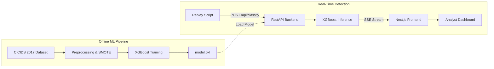

# SentinelAI

**AI-Based Intrusion Detection System**  
Cyber Defense & Security Analyst Internship — Blackbucks · 2026

SentinelAI is a full-stack intrusion detection platform that classifies malicious network traffic in real time using a trained XGBoost model and surfaces prioritized alerts through a live analyst dashboard. Built on the CICIDS 2017 benchmark dataset, it targets ≥95% F1-score across eight attack categories while maintaining a hardened, production-grade application security posture.

---

## Architecture



---

## Model Performance

| Metric | Score |
|--------|-------|
| **Weighted F1-Score** | **0.9977 (99.77%)** |
| **Accuracy** | **99.77%** |
| **False Positive Rate** | **< 0.5%** |
| **Dataset** | CICIDS 2017 (2.8 Million flows) |
| **Classifier** | XGBoost 2.1 |
| **Classes** | 15 (BENIGN + 14 attack categories) |

### Detailed Classification Report
```text
                            precision    recall  f1-score   support

                    BENIGN       1.00      1.00      1.00    419012
                       Bot       0.38      1.00      0.55       390
                      DDoS       1.00      1.00      1.00     25603
             DoS GoldenEye       0.98      1.00      0.99      2057
                  DoS Hulk       1.00      1.00      1.00     34569
          DoS Slowhttptest       0.96      1.00      0.98      1046
             DoS slowloris       0.98      0.99      0.98      1077
               FTP-Patator       1.00      1.00      1.00      1186
                Heartbleed       0.67      1.00      0.80         2
              Infiltration       0.70      1.00      0.82         7
                  PortScan       0.99      1.00      0.99     18139
               SSH-Patator       0.99      1.00      1.00       644
  Web Attack - Brute Force       0.72      0.70      0.71       294
Web Attack - Sql Injection       0.10      0.50      0.17         4
          Web Attack - XSS       0.30      0.58      0.40       130

                  accuracy                           1.00    504160
                 macro avg       0.78      0.92      0.83    504160
              weighted avg       1.00      1.00      1.00    504160
```

### Confusion Matrix
Below is the confusion matrix generated from the held-out test set:


---

## Attack Classes Detected

* **BENIGN** (Normal everyday traffic)
* **DoS / DDoS** (Hulk, GoldenEye, Slowloris, Slowhttptest, DDoS)
* **Brute Force** (FTP-Patator, SSH-Patator)
* **Reconnaissance** (PortScan)
* **Web Attacks** (Brute Force, XSS, SQL Injection)
* **Other Threats** (Botnet, Infiltration, Heartbleed)

---

## Tech Stack

| Layer | Technology |
|-------|-----------|
| ML | Python 3.12 · XGBoost 2.1 · Scikit-learn 1.5 · SMOTE |
| Backend | FastAPI 0.115 · Uvicorn · Pydantic v2 · JWT |
| Frontend | Next.js 15 · TypeScript · Recharts · Tailwind CSS |

---

## Setup

### Prerequisites
- Python 3.12+
- Node.js 20 LTS+
- CICIDS 2017 dataset CSVs (see Dataset section)

### 1. Clone and configure environment

```bash
git clone https://github.com/yourusername/sentinelai.git
cd sentinelai
cp .env.example .env
# Fill in values in .env — see .env.example for required keys
```

### 2. Train the model

```bash
cd ml
pip install -r requirements.txt
python train.py
# Outputs: model.pkl, label_encoder.pkl, feature_importance.json
```

### 3. Start the backend

```bash
cd backend
uvicorn main:app --host 0.0.0.0 --port 8000
```

### 4. Start the frontend

```bash
cd frontend
npm install
npm run dev
# Dashboard at http://localhost:3000
```

### 5. Run the demo replay

```bash
# In a separate terminal, after logging into the dashboard
cd ml
python replay.py --delay 200
```

---

## Dataset

The CICIDS 2017 benchmark dataset is sourced from Kaggle. 

The preprocessing script (`preprocess.py`) automatically downloads the dataset files via `kagglehub` and processes them directly, so no manual download is required.

---

## Environment Variables

See `.env.example` for the full list. Required keys:

```
SECRET_KEY=          # JWT signing secret (generate with: openssl rand -hex 32)
ADMIN_USER=          # Dashboard login username
ADMIN_PASS_HASH=     # bcrypt hash of admin password
MODEL_PATH=          # Path to model.pkl
```

**Never commit `.env`.** It is gitignored by default.

---

## Security Design

- JWT authentication required on all API routes except `/api/auth/login`
- All inputs validated via Pydantic v2 before reaching the model
- No secrets in source code — loaded exclusively from environment variables
- Production FastAPI runs with `debug=False` — no stack traces exposed
- Security headers (`X-Content-Type-Options`, `X-Frame-Options`) on all responses
- CORS restricted to `localhost:3000` in development
- httpOnly cookie for JWT storage — not accessible via JavaScript

---

## Project Structure

```
sentinelai/
├── ml/
│   ├── train.py
│   ├── evaluate.py
│   ├── replay.py
│   ├── preprocess.py
│   └── data/raw/          # CICIDS CSVs (gitignored)
├── backend/
│   ├── main.py
│   ├── auth.py
│   ├── classify.py
│   ├── stream.py
│   ├── schemas.py
│   └── config.py
├── frontend/
│   ├── app/
│   └── components/
├── .env.example
├── .gitignore
├── CLAUDE.md
└── README.md
```

---

## Author

**Shyam** · B.Tech CSE (Data Science) · AITS Rajampet  
Cyber Defense & Security Analyst Intern · Blackbucks · 2026
