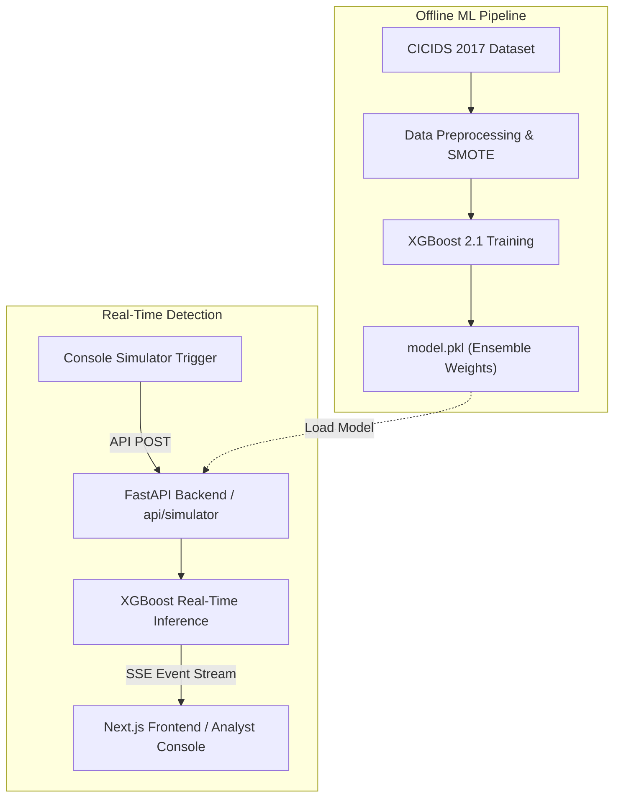
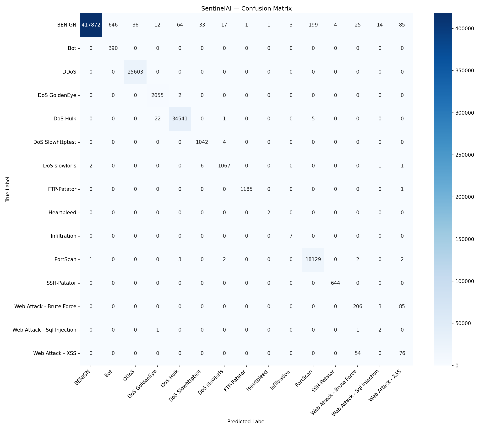

# SentinelAI

**Real-Time Intrusion Detection System**  
Cyber Defense & Security Analyst Internship — Blackbucks · 2026

SentinelAI is a full-stack, real-time intrusion detection platform designed to classify network traffic and stream threat alerts. Utilizing an XGBoost machine learning classifier trained on the CICIDS 2017 benchmark dataset, the system detects 14 specific attack classes alongside normal traffic, achieving a 99.77% Weighted F1-score.

---

## System Architecture



---

## Model Validation Metrics

| Metric | Score |
|--------|-------|
| **Weighted F1-Score** | **99.77%** |
| **Accuracy** | **99.77%** |
| **False Positive Rate** | **< 0.5%** |
| **Dataset** | CICIDS 2017 (2.8 Million flows) |
| **Classifier** | XGBoost 2.1 |

### Confusion Matrix



For detailed model parameters and performance reports, refer to [ml/README.md](file:///d:/sentinelai/ml/README.md).

---

## Setting up Environment Variables (ENV)

Create a file named `.env` in the root directory. You can use `.env.example` as a template. The file contains critical credentials and path configurations:

```text
SECRET_KEY=             # JWT token signature key
ADMIN_USER=             # Administrative username
ADMIN_PASS_HASH=        # Bcrypt hash of the admin password
MODEL_PATH=             # Path to model.pkl
LABEL_ENCODER_PATH=      # Path to label_encoder.pkl
FEATURE_IMPORTANCE_PATH= # Path to feature_importance.json
```

### How to Generate Secure Values:

1. **JWT Secret Key:**
   Generate a secure, random 32-character hexadecimal key in your terminal:
   ```bash
   python -c "import secrets; print(secrets.token_hex(32))"
   ```

2. **Bcrypt Password Hash:**
   Generate the hashed value of your custom plain-text password using the python-bcrypt package:
   ```bash
   python -c "import bcrypt; print(bcrypt.hashpw(b'YOUR_CUSTOM_PASSWORD', bcrypt.gensalt()).decode())"
   ```
   Copy the output string (which starts with `$2b$`) directly into the `ADMIN_PASS_HASH` variable in `.env`.

---

## Quick Setup & Launch Checklist

Ensure Python 3.12+ and Node.js 20+ are installed.

```bash
# 1. Clone & Configure Environment
git clone https://github.com/Shyamyemuka/sentinelai.git
cd sentinelai
cp .env.example .env
# Edit the .env file with your generated values (see env section above)

# 2. Virtual Env Setup & ML Training
python -m venv venv
# Activate the venv:
.\venv\Scripts\Activate.ps1   # On Windows PowerShell
source venv/bin/activate      # On Unix/macOS

# Install dependencies and build model
pip install -r ml/requirements.txt
pip install -r backend/requirements.txt
python ml/preprocess.py
python ml/train.py

# 3. Start Backend Server
python -m uvicorn backend.main:app --host 127.0.0.1 --port 8000

# 4. Start Next.js Frontend (New Terminal)
cd frontend
npm install
npm run dev

# 5. Connect and Run
# Open http://localhost:3000 in your browser, log in with your credentials,
# and click "Start" next to the connection status badge on the dashboard.
```

---

## Project Structure

```text
sentinelai/
├── ml/
│   ├── preprocess.py      # Cleans, downsamples, and balances dataset
│   ├── train.py           # Trains the XGBoost model
│   ├── evaluate.py        # Validates model metrics
│   ├── replay.py          # Standalone traffic stream simulator utility
│   └── README.md          # Machine learning pipeline documentation
├── backend/
│   ├── main.py            # API server routing
│   ├── auth.py            # Password hashing & JWT validation
│   ├── classify.py        # Real-time inference routing
│   ├── stream.py          # Server-Sent Events broker
│   ├── simulator.py       # Background simulator loop manager
│   ├── schemas.py         # Network flow validators
│   ├── config.py          # Settings loader
│   └── README.md          # Backend server documentation
├── frontend/
│   ├── app/               # Landing, Login, and Dashboard routers
│   ├── components/        # Interactive visuals and feeds
│   └── README.md          # Frontend architecture specifications
├── .env.example
├── .gitignore
└── README.md
```

---

## Internship Details

**Author:** Shyam  
*B.Tech CSE (Data Science) · AITS Rajampet*  
**Role:** Cyber Defense & Security Analyst Intern  
**Company:** Blackbucks  
**Project Date:** 2026
